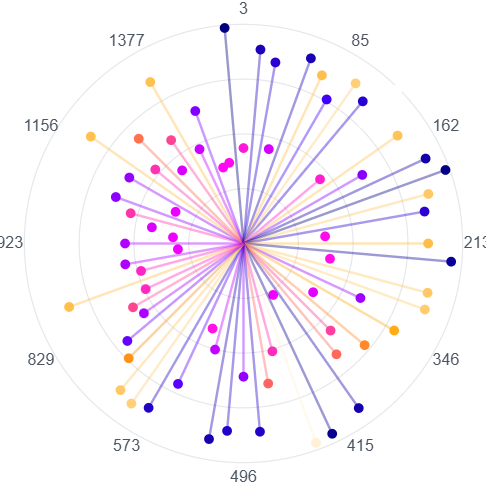
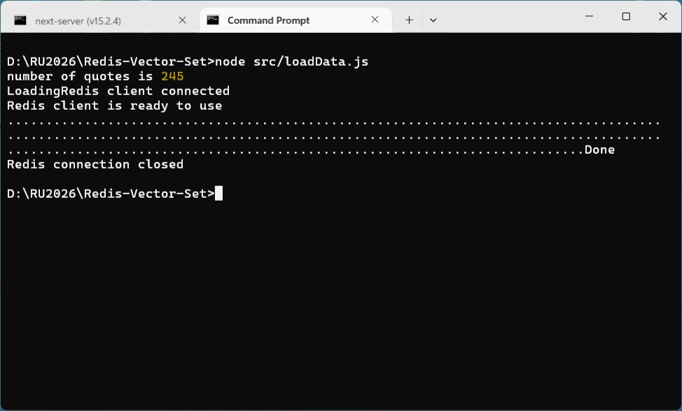
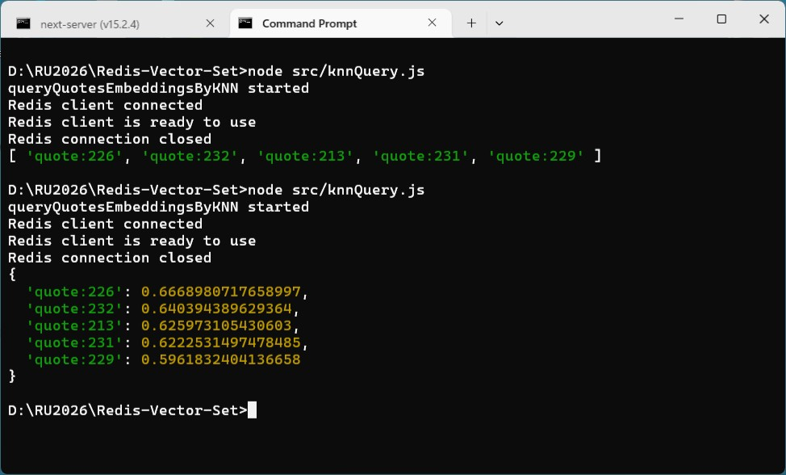
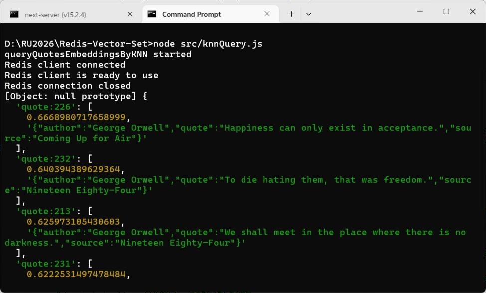
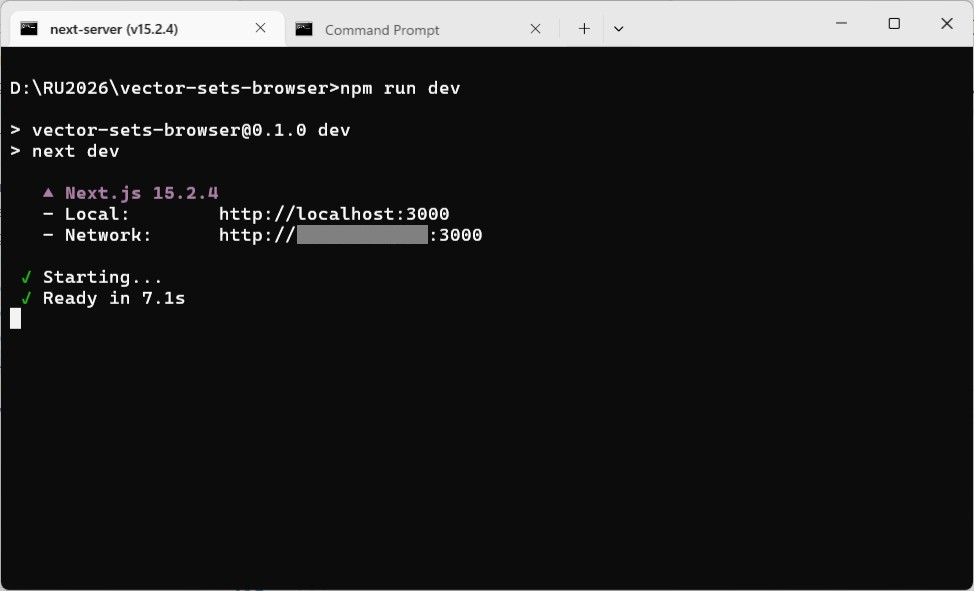
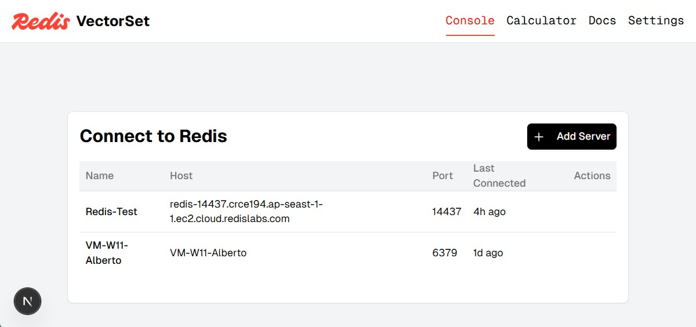
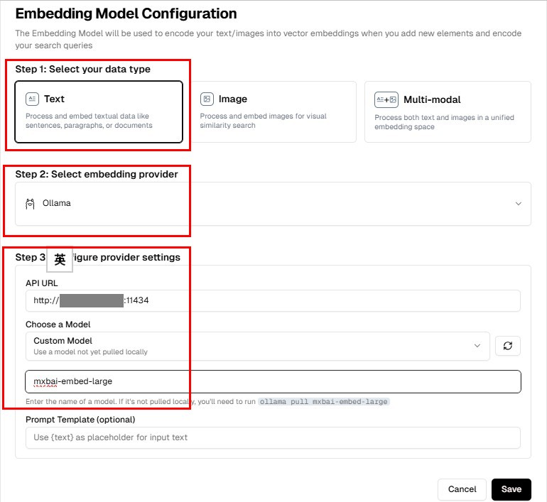
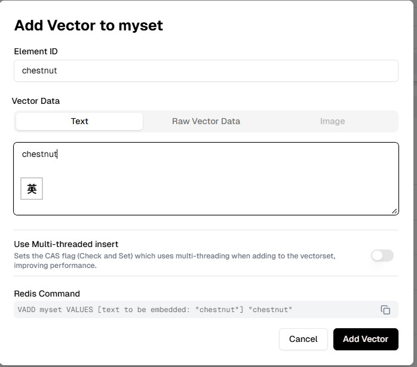
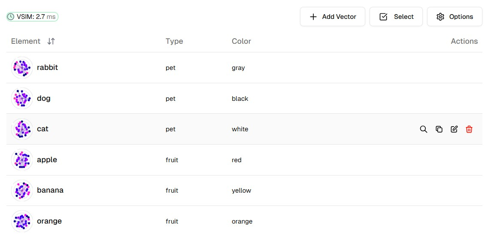
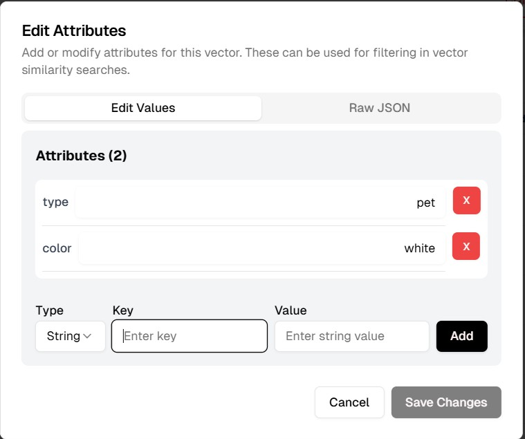

### Preliminary study on [Redis Vector Set](https://redis.io/docs/latest/develop/data-types/vector-sets/)
> "Nasci num tempo em que a maioria dos jovens tinham perdido a crença em Deus, pela mesma razão que os seus maiores a tinham tido — sem saber porquê. E então, porque o espírito humano tende naturalmente para criticar porque sente, e não porque pensa, a maioria desses jovens escolheu a Humanidade para sucedâneo de Deus."<br /><br />
"I was born in a time when the majority of young people had lost faith in God, for the same reason their elders had had it – without knowing why. And since the human spirit naturally tends to make judgements based on feeling instead of reason, most of these young people chose Humanity to replace God." <br/>--- The Book of Disquiet by Fernando Pessoa




#### Prologue 
Vector Set is a new feature introduced in Redis 8.0. Be sure to check the availability before jumping into it. 

```
> INFO MODULES
# Modules
module:name=vectorset,ver=1,api=1,filters=0,usedby=[],using=[],options=[handle-io-errors|handle-repl-async-load]

> MODULE LIST
1) 1) "name"
   2) "vectorset"
   3) "ver"
   4) "1"
   5) "path"
   6) ""
   7) "args"
   8) (empty list or set)
```


#### I. [Announcing vector sets, a new Redis data type for vector similarity](https://redis.io/blog/announcing-vector-sets-a-new-redis-data-type-for-vector-similarity/) (TL;DR)

Inspired by the core principles of Redis and developed by the original creator of Redis, Salvatore Sanfilippo, vector sets enhance Redis’s capabilities as a versatile solution for modern AI applications. Vector sets complement the existing powerful vector search in Redis (Redis Query Engine) by offering a Redis-friendly alternative for specific use-cases. 

Salvatore Sanfilippo (aka ‘antirez’), the creator of Redis, recently rejoined the company and is the creator of this innovative data type; his expertise has led to the creation of an API that is both simple and intuitive, reflecting Redis’s philosophy of delivering high-performance solutions with minimal complexity.

##### **What are vector sets?**
Vector sets take inspiration from sorted sets, one of Redis’s fundamental data types known for its efficiency in handling ordered collections. Vector sets extend this concept by allowing the storage and querying of high-dimensional vector embeddings, which are crucial for various AI and machine learning applications. Like a sorted set, a vector set has string elements that are associated with a vector instead of a score. The fundamental goal of vector sets is to make it possible to add items, and later get a subset of the added items that are the most similar to a specified vector.

Consider a scenario where you want to store and retrieve vector embeddings for various text descriptions or images. With vector sets, you can easily store these embeddings and perform efficient similarity searches. vector sets also implements some exciting additional capabilities including:

- **Quantization**: In a vector set, the vectors are quantized by default to 8 bit values. However, this can be modified to no quantization or binary quantization when adding the first element. 	 
---
**Supplementary**

**Vectors in Redis Vector Sets** are usually arrays of floating‑point numbers (e.g., embeddings from text or images).

• **Quantization** is a technique to reduce the precision of those numbers so they take less memory and can be searched faster.

• By default, Redis Vector Set stores vectors in **8‑bit quantized form**:

•• Each floating‑point value is scaled and mapped into a single byte (0–255).

•• This reduces storage size and speeds up similarity search.

•• The trade‑off: you lose some precision compared to full 32‑bit floats.

---

- **Dimensionality Reduction**: The number of dimensions in a vector can be reduced by random projection by specifying the option and the number of dimensions.
---
**Supplementary**

• **Dimensionality**: A vector is just a list of numbers. For example, a text embedding might have 768 dimensions (768 numbers). The more dimensions, the more detail it can capture — but also the more memory and computation it requires.

• **Dimensionality Reduction**: This means shrinking the vector from, say, 768 dimensions down to 128 or 256. You’re compressing the information into fewer numbers.

• **Random Projection**: One way to reduce dimensions is to project the high‑dimensional vector into a lower‑dimensional space using a *random matrix*.

•• Imagine shining a light on a 3D object to cast a 2D shadow. You lose some detail, but the shadow still preserves the overall shape.

•• Random projection does something similar mathematically: it “shadows” the original vector into fewer dimensions.

• **Specifying the Option and Number of Dimensions**: When you create your vector set, you can tell Redis:

•• “I want to reduce vectors to 128 dimensions.”

•• Redis will then apply random projection automatically when storing vectors.

---

- **Filtering**: Each element of the vector set can be associated with a set of attributes specified as a JSON blob via the `VADD` or `VSETATTR` command. This allows the ability to filter for a subset of elements using `VSIM` that are verified by the expression.
---
**Supplementary**

• **Each element of the vector set**:
Every vector you add (e.g., an embedding for “Taipei”) isn’t just numbers — you can also attach extra information (population, area, description, etc.).

• **Associated with a set of attributes**:
These extra fields are stored as a **JSON blob**. For example:
```
VADD cities VALUES 2 121.5654 25.0330 "Taipei" SETATTR "{ \"city_en\": \"Taipei\", \"city_zh\": \"台北市\", \"longitude\": 121.5654, \"latitude\": 25.0330, \"description\": \"The capital of Taiwan, a cultural and political hub known for Taipei 101 and vibrant night markets.\", \"population\": 2779200, \"area_m2\": 271800000 }"
```

• Here, the vector for Taipei has attributes: population, area_m2, description.

• **Via VADD or VSETATTR**

• `VADD` → when you first insert the vector, you can attach attributes.

• `VSETATTR` → later, you can update or add attributes to an existing vector.

• **Filter for a subset of elements using VSIM**
When you run a similarity search (`VSIM`), you don’t have to search across *all* vectors. You can filter by attributes.
For example:
```
> VSIM cities ELE Taipei WITHSCORES COUNT 5 FILTER '.population > 1000000'
1) "Kaohsiung"
2) "1"
3) "Taipei"
4) "0.9998820126056671"
5) "New-Taipei"
6) "0.9998786747455597"
7) "Taoyuan"
8) "0.9998691380023956"
9) "Taichung"
10) "0.9996747970581055"
```

• This finds the 5 most similar vectors to “Taipei” but only among cities with population greater than 1,000,000.

• **Verified by the expression**
The filter expression (like `.population > 1000000 AND .area_m2 < 500000000`) is applied to the attributes. Only vectors that satisfy the expression are considered in the similarity search.

```
> VSIM cities ELE Taipei WITHSCORES COUNT 5 FILTER '.population > 1000000 and .area_m2 < 500000000'
1) "Taipei"
2) "0.9998820126056671"
```
---

##### **Vector set commands**

Below are some examples of commands you can use with a vector set. For a full list, see our documentation [here](https://redis.io/docs/latest/commands/?group=vector_set).

```
# Add keys to the vector set 
VADD myset REDUCE 3 VALUES 4 0.5 1.2 0.75 3.8 element1 Q8 EF 200 SETATTR "{ \"element\": 1 }" M 16 
VADD myset REDUCE 3 VALUES 4 0.9 1.5 0.66 4.5 element2 SETATTR "{ \"element\": 2 }"
VADD myset REDUCE 3 VALUES 4 0.4 1.9 0.92 3.6 element3 SETATTR "{ \"element\": 3 }"
VADD myset REDUCE 3 VALUES 4 0.7 1.3 0.85 4.1 element4 SETATTR "{ \"element\": 4 }"

# Number of dimensions of the vectors in vector set.
VDIM myset 

# VADD myset VALUES 3 1.3 0.85 4.1 element5
# "ERR Vector dimension mismatch - got 3 but set has 3"

# Retrieve the top 3 most similar keys to a given query vector with similarity scores
VSIM myset ELE element4 WITHSCORES COUNT 3

# More options
> VSIM myset ELE element4 WITHSCORES WITHATTRIBS COUNT 3 EPSILON 0.2 EF 100 FILTER '.element >=1 and .element <=3' TRUTH NOTHREAD
1) "element1"
2) "0.9994525909423828"
3) "{ \"element\": 1 }"
4) "element2"
5) "0.9993630647659302"
6) "{ \"element\": 2 }"
7) "element3"
8) "0.9975350797176361"
9) "{ \"element\": 3 }"

# Remove a key from the set
VREM myset element5

# Count the number of elements in the vector set
VCARD myset

# Show info about a vector set including stored elements, vector dimensions, quantization etc. 
VINFO myset
```

##### **Redis Query Engine and vector sets**

Redis now offers two complementary search capabilities—the Redis Query Engine for comprehensive, enterprise-grade search & querying, and the new vector set as a native data-type that is lightweight and specialized vector similarity search.

Redis Query Engine excels at fast full-text, numerical, vector, and hybrid queries over large scalable datasets, *while vector sets provide a streamlined alternative with a simple API*. Together, they reinforce Redis’s commitment to performance, flexibility, and developer-friendly search solutions.

Vector sets may be a great choice when your application **primarily focuses on vector similarity use-cases** without the need for advanced search and querying, particularly those involving full-text, or hybrid queries. If you’re building **AI-driven applications** and want a **lightweight, efficient** way to store and query high-dimensional embeddings, vector sets can offer a **simple, streamlined** alternative.

Meanwhile, Redis Query Engine, which is included in [Redis 8](https://redis.io/blog/introducing-another-era-of-fast/) is the fastest search and vector database on the market delivering enterprise-grade solutions for a number of scenarios including:

• **Comprehensive search and querying**: Support for diverse query types enables powerful combinations of vector similarity, full-text search, numerical filtering, and geospatial operations. RQE also seamlessly indexes Redis data-structures such as Hash and JSON for flexible and adjustable query needs.

• **Scalability**: Redis Query Engine offers a horizontally scalable solution (with automatic sharding and management of the distributed architecture) to support large datasets. In addition, it offers multi–threaded search to deliver strong throughput, low latency and fast indexing that makes Redis the fastest vector database solution on the market.

• **GenAI ecosystem**: Strong ecosystem support including integrations with popular frameworks such as Langchain (and LangGraph), and LllamaIndex, as well as our dedicated python library for GenAI apps (RedisVL).

##### **Getting started with vector sets**

Getting started with vector sets is straightforward. Simply deploy the latest version of Redis to get started. For comprehensive instructions on storing and querying vectors, configuration options, and best practices, visit [our documentation here](https://redis.io/docs/latest/develop/data-types/vector-sets/).

Finally, we will also be adding support to various Redis client libraries starting with support in redis-py.

We are immensely excited to see what the developer community will build using vector sets. We look forward to your feedback and innovations, as we continue to evolve Redis to meet the ever-changing needs of the tech landscape. We also encourage you to share your feedback through our GitHub issues or community forums. Have a fun time building.


#### II. [VADD](https://redis.io/docs/latest/commands/vadd/)
```
VADD key [REDUCE dim] (FP32 | VALUES num) vector element 
     [CAS] 
     [NOQUANT | Q8 | BIN]
     [EF build-exploration-factor] 
     [SETATTR attributes] 
     [M numlinks]
```
Add a new element into the vector set specified by key. The vector can be provided as 32-bit floating point (FP32) blob of values, or as floating point numbers as strings, prefixed by the number of elements.

**Optional arguments**

**REDUCE dim**

implements random projection to reduce the dimensionality of the vector. The projection matrix is saved and reloaded along with the vector set. Please note that the REDUCE option must be passed immediately before the vector. For example,
```
VADD mykey REDUCE 50 VALUES ...
```

**CAS**

performs the operation partially using threads, in a check-and-set style. The neighbor candidates collection, which is slow, is performed in the background, while the command is executed in the main thread.

**NOQUANT**

in the first VADD call for a given key, NOQUANT forces the vector to be created without int8 quantization, which is otherwise the default.

**BIN**

forces the vector to use binary quantization instead of int8. This is much faster and uses less memory, but impacts the recall quality.

**Q8**

forces the vector to use signed 8-bit quantization. **This is the default**, and the option only exists to make sure to check at insertion time that the vector set is of the same format.

> Note:
NOQUANT, Q8, and BIN are mutually exclusive.

**EF build-exploration-factor**

plays a role in the effort made to find good candidates when connecting the new node to the existing Hierarchical Navigable Small World (HNSW) graph. **The default is 200.** Using a larger value may help in achieving a better recall. To improve the recall it is also possible to increase EF during VSIM searches.

**SETATTR attributes**

associates attributes in the form of a JavaScript object to the newly created entry or updates the attributes (if they already exist). It is the same as calling the VSETATTR command separately.

**M numlinks**

is the maximum number of connections that each node of the graph will have with other nodes. The default is 16. More connections means more memory, but provides for more efficient graph exploration. Nodes at layer zero (every node exists at least at layer zero) have M * 2 connections, while the other layers only have M connections. For example, setting M to 64 will use at least 1024 bytes of memory for layer zero. That's M * 2 connections times 8 bytes (pointers), or 128 * 8 = 1024. For higher layers, consider the following:

- Each node appears in ~1.33 layers on average (empirical observation from HNSW papers), which works out to be 0.33 higher layers per node.
- Each of those higher layers has M = 64 connections.

So, the additional amount of memory is approximately 0.33 × 64 × 8 ≈ 169.6 bytes per node, bringing the total memory to ~1193 bytes.

If you don't have a recall quality problem, the default is acceptable, and uses a minimal amount of memory.

`loadData.js`
```
import { redis } from "./redis/redis.js"
import { generateSentenceEmbeddings } from "./text-vector-gen.js"
import { quotes } from './quotes.js'

async function main() {
  console.log('number of quotes is', quotes.length)
  process.stdout.write('Loading')
  await redis.connect();
  for (let i = 0; i < quotes.length; i++) { 
    process.stdout.write(".");
    
    const embeddings = await generateSentenceEmbeddings(quotes[i].quote);    
    await redis.vAdd("quotes", embeddings, `quote:${i+1}`, {
      SETATTR: quotes[i]
    });
  }
  console.log('Done')
  await redis.close()
}

main()
```



#### III. [VSIM](https://redis.io/docs/latest/commands/vsim/)
```
VSIM key (ELE | FP32 | VALUES num) (vector | element) 
     [WITHSCORES] 
     [WITHATTRIBS] 
     [COUNT num]     
     [EPSILON delta] 
     [EF search-exploration-factor] 
     [FILTER expression] 
     [FILTER-EF max-filtering-effort]     
     [TRUTH] [NOTHREAD]
```
Return elements similar to a given vector or element. Use this command to perform approximate or exact similarity searches within a vector set.

**Optional arguments** 

**WITHSCORES**

returns the similarity score (from 1 to 0) alongside each result. A score of 1 is identical; 0 is the opposite.

**WITHATTRIBS**

returns, for each element, the JSON attribute associated with the element or NULL when no attributes are present.

**COUNT num**

limits the number of returned results to num.

**EPSILON delta**

is a floating point number between 0 and 1. It is used to retrieve elements that have a distance that is no further than the specified delta. In vector sets, returned elements have a similarity score (when compared to the query vector) that is between 1 and 0, where 1 means identical and 0 means opposite vectors. For example, if the EPSILON option is specified with an argument of 0.2, it means only elements that have a similarity of 0.8 or better (a distance < 0.2) are returned. This is useful when you specify a large COUNT, but you don't want elements that are too far away from the query vector.

**EF search-exploration-factor**

controls the search effort. Higher values explore more nodes, improving recall at the cost of speed. Typical values range from 50 to 1000.

**FILTER expression**

applies a filter expression to restrict matching elements. See the filtered search section for syntax details.

**FILTER-EF max-filtering-effort**

limits the number of filtering attempts for the FILTER expression. See the filtered search section for more.

**TRUTH**

forces an exact linear scan of all elements, bypassing the HNSW graph. Use for benchmarking or to calculate recall. This is significantly slower (O(N)).

**NOTHREAD**

executes the search in the main thread instead of a background thread. Useful for small vector sets or benchmarks. This may block the server during execution.

```
VSIM quotes ELE quote:241 WITHSCORES WITHATTRIBS COUNT 5

VSIM quotes ELE quote:241 WITHSCORES WITHATTRIBS COUNT 5 FILTER ".author == 'George Orwell'"   
```

`knnQuery.js`
```
import { redis } from "./redis/redis.js"
import { generateSentenceEmbeddings } from "./text-vector-gen.js"

const float32Buffer = (arr) => {
    const floatArray = new Float32Array(arr);
    const float32Buffer = Buffer.from(floatArray.buffer);
    return float32Buffer;
  };

//A KNN query will give us the top n documents that best match the query vector.
const queryQuoteEmbeddingsByKNN = async (
      _searchTxt,
      _resultCount,
    ) => {
    console.log(`queryQuotesEmbeddingsByKNN started`);
    await redis.connect();
    await redis.hello(3)
    let results = {};
    if (_searchTxt) {
      _resultCount = _resultCount ?? 5;
      const searchTxtVectorArr = await generateSentenceEmbeddings(_searchTxt);
  
      results = await redis.vSim('quotes', searchTxtVectorArr, { 
        COUNT: _resultCount, 
        FILTER: '.author == "George Orwell"'
      })
    } else {
      throw 'Search text cannot be empty';
    }
  
    await redis.close()
    return results;
  };

async function main() {
  const results = await queryQuoteEmbeddingsByKNN('dream love death')
  console.log(results)    
}

main()
```


To return with scores like so: 
```
  results = await redis.vSimWithScores('quotes', searchTxtVectorArr, { 
            COUNT: _resultCount, 
            FILTER: '.author == "George Orwell"'
      })
```

To perform more complicated search: 
```
  results = await redis.sendCommand([
            'VSIM', 'quotes', 'FP32', float32Buffer(searchTxtVectorArr), 'WITHSCORES', 'WITHATTRIBS', 'COUNT', _resultCount.toString(), 'FILTER', '.author == "George Orwell"'
      ])
```



#### IV. [Vector Sets Browser](https://github.com/redis/vector-sets-browser)
> A modern web-based visualization and interaction tool for Redis Vector Sets. This application provides an intuitive interface for exploring and analyzing vector embeddings stored in Redis vector-sets.





[Docs](./VSETS-README.md)

```
node src/sample.js
Redis client connected
Redis client is ready to use
true
true
true
true
true
true
vectorset
6
2
[ 0.9999999403953552, 0.9999999403953552 ]
[ -0.9999999403953552, -0.9999999403953552 ]
[ -0.9999999403953552, 0.9999999403953552 ]
[ 0.9999999403953552, -0.9999999403953552 ]
[ 1, 0 ]
true
{ name: 'Point A', description: 'First point added' }
true
null
true
7
true
6
[ 'pt:E', 'pt:X', 'pt:A', 'pt:D', 'pt:C', 'pt:B' ]
{
  'pt:A': 1,
  'pt:X': 0.9730966687202454,
  'pt:E': 0.8535534143447876,
  'pt:D': 0.5
}
true
true
true
true
true
[ 'pt:A', 'pt:C', 'pt:B' ]
[ 'pt:C', 'pt:B' ]
true
Q8: 1.2643694877624512,1.958230972290039
true
NOQUANT: 1.262184977531433,1.958230972290039
true
BIN: 1,1
true
300
true
100
Redis connection closed
```





```
> VDIM myset
(integer) 1024

> VCARD myset 
(integer) 6

> VRANDMEMBER myset 3
1) "rabbit"
2) "dog"
3) "cat"

> VRANGE myset - + 
1) "apple"
2) "banana"
3) "cat"
4) "dog"
5) "orange"
6) "rabbit"

> VSIM myset ELE rabbit WITHSCORES
1) "rabbit"
2) "1"
3) "dog"
4) "0.8323670625686646"
5) "cat"
6) "0.818394809961319"
7) "banana"
8) "0.8101015985012054"
9) "orange"
10) "0.7664429843425751"
11) "apple"
12) "0.7247345447540283"

> VINFO myset
1) "quant-type"
2) "int8"
3) "hnsw-m"
4) "16"
5) "vector-dim"
6) "1024"
7) "projection-input-dim"
8) "0"
9) "size"
10) "6"
11) "max-level"
12) "1"
13) "attributes-count"
14) "0"
15) "vset-uid"
16) "3"
17) "hnsw-max-node-uid"
18) "7"

> VLINKS myset apple WITHSCORES
1) 1) "banana"
   2) "0.8396873474121094"
   3) "orange"
   4) "0.8346734046936035"
   5) "cat"
   6) "0.8273847103118896"
   7) "dog"
   8) "0.7663518190383911"
   9) "rabbit"
   10) "0.7248668074607849"

> VISMEMBER myset ox
(integer) 0

> VISMEMBER myset cat
(integer) 1

> VEMB myset cat 
1) "-0.013032710179686546"
2) "0.014894526451826096"
3) "0.016756342723965645"
. . . 
1024) "-0.005585447419434786"

> VSETATTR myset cat "{\"type\": \"pet\", \"color\": \"white\"}" 
(integer) 1

> VGETATTR myset cat 
"{\"type\": \"pet\", \"color\": \"white\"}"
```





#### V. Biblipgraphy 
1. [A First Look at Vector Sets](https://medium.com/the-guy-wire/a-first-look-at-vector-sets-dd91cb59123e)
2. [Getting started with vector sets](https://redis.io/learn/howtos/vector-sets-basics)
3. [Redis vector sets](https://redis.io/docs/latest/develop/data-types/vector-sets/)
4. [Vector Sets Browser](https://github.com/redis/vector-sets-browser)
5. [Redis 8.4.0 for Windows](https://github.com/redis-windows/redis-windows/releases)
6. [Introduction to vector sets: main commands and ideas](https://youtu.be/kVApsFUeuEA)
7. [Insiemi vettoriali: l'implementazione e i bias di VRANDMEMBER](https://youtu.be/XregAstUets)
8. [Ollama](https://ollama.com/)
9. [The Book of Disquiet by Fernando Pessoa](https://dn720004.ca.archive.org/0/items/english-collections-1/Book%20of%20Disquiet%2C%20The%20-%20Fernando%20Pessoa.pdf)


#### Epilogue 
"To learn from comparison." is my motto. Previously, I wrote a small article on [Redis Vector Search](https://github.com/Albert0i/RedisVectorSearch) to show how to use [Redis Query Engine](https://redis.io/docs/latest/develop/ai/search-and-query/) do Vector Search. It is reasonable to reuse the code and data. 

`loadData.js` with Redis Query Engine: 
```
    for (let i = 0; i < quotes.length; i++) { 
        quotes[i].embeddings = await generateSentenceEmbeddings(quotes[i].quote);
        await redisClient.call("JSON.SET", `quote:${i+1}`, "$", JSON.stringify(quotes[i]));
      }
```

`loadData.js` with Redis Vector Set:
```
    for (let i = 0; i < quotes.length; i++) { 
      const embeddings = await generateSentenceEmbeddings(quotes[i].quote);
      await redis.vAdd("quotes", embeddings, `quote:${i+1}`, {
        SETATTR: quotes[i]
      });
    }
```

`knnQuery.js` with Redis Query Engine: 
```
      _resultCount = _resultCount ?? 5;
      const searchTxtVectorArr = await generateSentenceEmbeddings(_searchTxt);
      const searchQuery = `(*)=>[KNN ${_resultCount} @embeddings $searchBlob AS score]`;
  
      results = await redisClient.call('FT.SEARCH', 
                                       'idx:quotes', 
                                       searchQuery, 
                                       'RETURN', 4, 'score', 'author', 'quote', 'source', 
                                       'SORTBY', 'score', 'ASC', 
                                       'PARAMS', 2, 'searchBlob', 
                                                    float32Buffer(searchTxtVectorArr), 
                                       'DIALECT', 2);
```

`knnQuery.js` with Redis Vector Set: 
```
      _resultCount = _resultCount ?? 5;
      const searchTxtVectorArr = await generateSentenceEmbeddings(_searchTxt); 
      results = await redis.sendCommand([
        'VSIM', 'quotes', 'FP32', float32Buffer(searchTxtVectorArr), 'WITHSCORES', 'WITHATTRIBS', 'COUNT', _resultCount.toString() 
      ])
```

Don't forget to create index for Redis Query Engine: 
```
FT.CREATE idx:quotes ON JSON PREFIX 1 quote:
  SCHEMA
  $.author as author TEXT NOSTEM SORTABLE
  $.quote as quote TEXT NOSTEM SORTABLE
  $.source as source TEXT NOSTEM SORTABLE
  $.embeddings as embeddings VECTOR FLAT 6
          TYPE FLOAT32
          DIM 768
          DISTANCE_METRIC COSINE
```

**Comparison Table**
| Feature  | Redis Query Engine | Redis Vector Sets (Redis 8)  |
|---------------------------|-------------------------------------------|-------------------------------------|
| **Status**               | Stable, production‑ready                  | Beta, experimental                  |
| **Indexing**             | Schema‑based, supports FLAT/HNSW/SVS      | Native set abstraction, no schema   |
| **Filtering**             | Rich metadata filters (text, numeric, geo)| Limited / not primary focus         |
| **Hybrid queries**        | Yes (vector + metadata)                   | Not yet                             |
| **Ease of use**           | More setup, but powerful                  | Simpler, lightweight                |
| **Best use case**         | Complex RAG, semantic search pipelines    | Quick similarity search, prototyping|


### EOF (2026/01/01)
